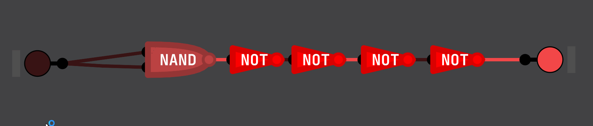
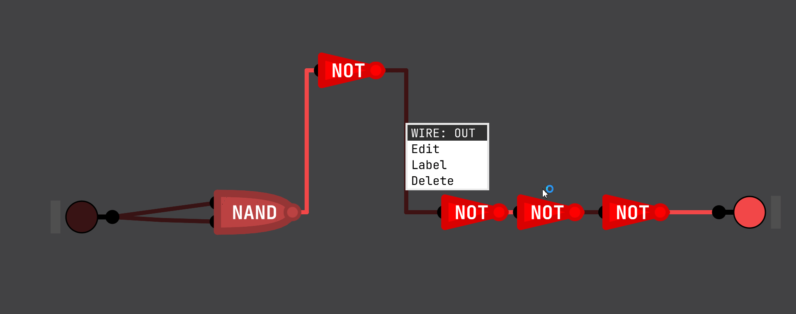
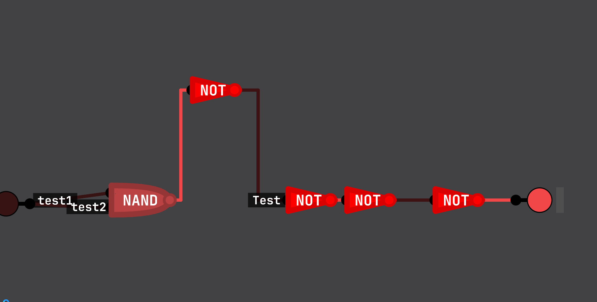
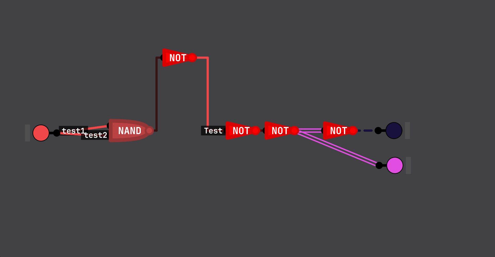
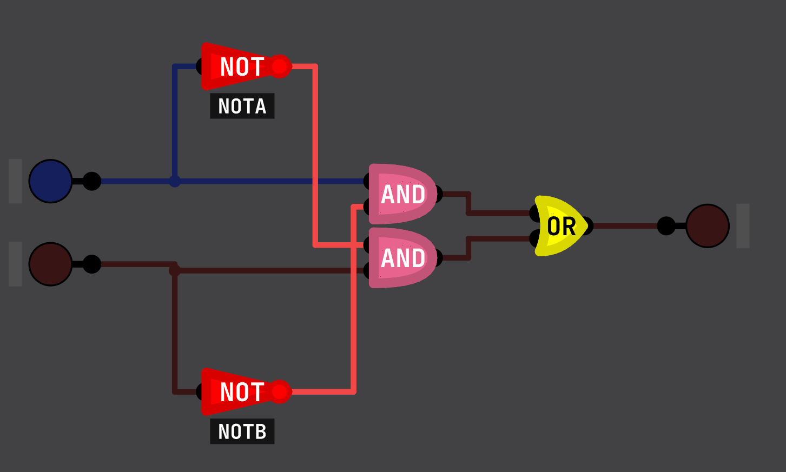
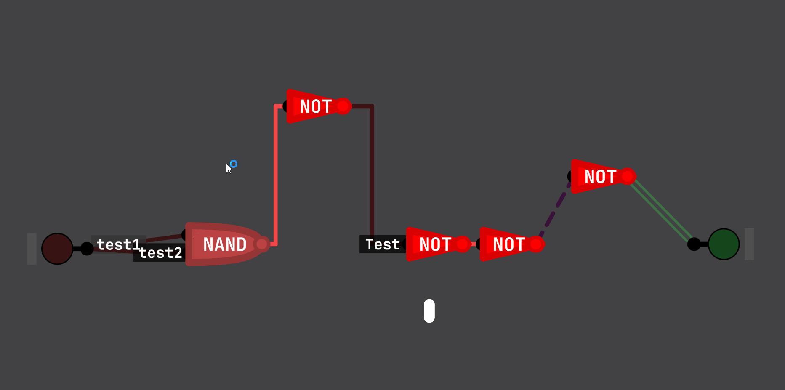
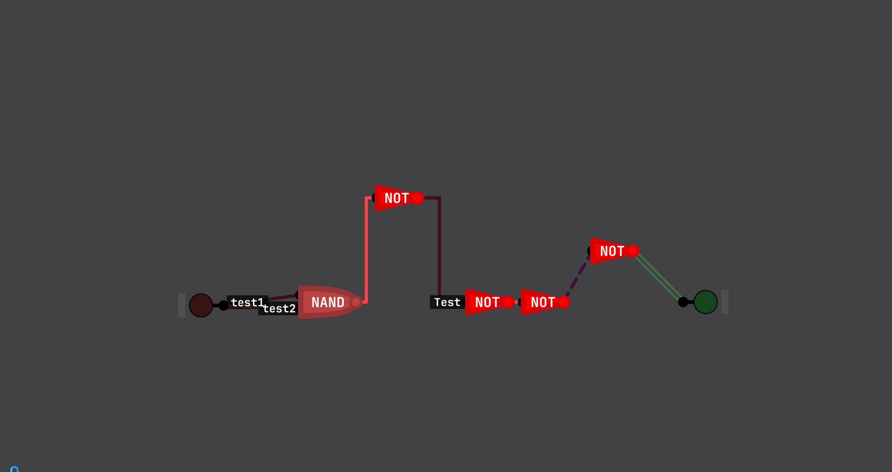
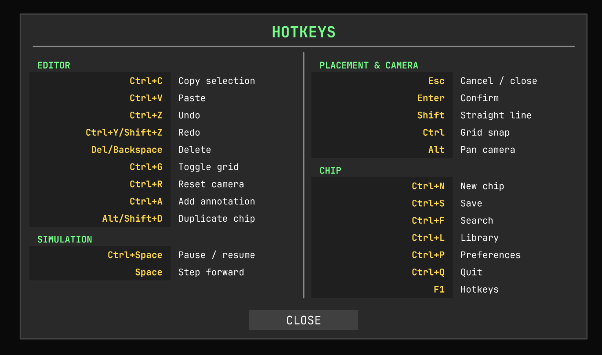

# Release v2.2.0 — 2026-06-21

## Overview

v2.2.0 is a major feature release built on top of Sebastian Lague's
Digital-Logic-Sim (v2.1.5). It ships in two variants:

| Variant | Who it's for | Cloud login |
|---------|-------------|-------------|
| **turma** | Institutions / classrooms | ✅ Firebase (email/password, classes, cloud sync) |
| **community** | Everyone else | ❌ Offline only — no credentials, no login screen |

---

## What's New

### Simulation

**One-tick propagation delay per chip instance**
Each chip instance now introduces exactly one simulation tick of delay,
regardless of internal complexity. This makes sequential circuits
(shift registers, counters, oscillators) behave predictably and
consistently with real hardware propagation delay.

---

### Editor — Wires

**Wire labels**
Any wire can now carry a text label. Labels are created via the wire
context menu and can be dragged freely along the wire to any position.
Useful for annotating bus lines, control signals, and clock wires.

**Wire style menu**
Output pins expose a colour and pattern selector (solid, dashed, double).
The style applies to every wire drawn from that pin, making signal types
visually distinct at a glance.

**Wire style inheritance from subchips**
When a wire connects to a subchip output pin that already has a style
defined, the wire inherits that style automatically.

---

### Editor — Visuals

**IEEE standard gate symbols**
AND, OR, NOT, NAND, NOR, XOR, and XNOR gates now display their IEEE
standard symbols (D-shape body, bubble, etc.) as an alternative to the
default rectangular style. Toggle per-chip from the context menu.

**Canvas annotations**
Free-floating text blocks can be placed anywhere on the canvas.
Double-click to enter inline editing mode. Useful for circuit
documentation, labels for chip regions, and teaching diagrams.

**Copy & Paste**
Copying and pasting a selection preserves wire colours, styles, and
labels — the pasted circuit looks exactly like the original.

---

### Editor — UX

**Hotkey guide (F1)**
Pressing F1 opens a two-column reference panel listing every keyboard
shortcut in the editor. Dismisses with Escape or F1 again.

---

### Cloud & Auth (turma variant only)

**Email/password authentication**
Users log in with an email and password. First-time users can register
directly inside the app. Password reset is available from the sign-in
screen without leaving the application.

**Mandatory user profile**
After first login, users complete their profile (display name, student ID,
and class). The app blocks access to the main editor until the profile
is complete.

**Class (turma) system**
Administrators manage classes through a web dashboard. Students select
their class during profile setup, enabling class-scoped project assignment.

**Cloud sync — projects and chips**
All projects and chips are synced to the cloud automatically. Sync happens
on save, on project open, and on logout.

**Keep logged in**
A checkbox on the sign-in screen persists the session across app restarts.

**Tab / Enter navigation in login form**
Tab moves focus from the email field to the password field. Enter while
the password field is focused submits the sign-in form.

---

## Artifacts

| File | Variant | Format |
|------|---------|--------|
| `Digital-Logic-Sim-Unifil-Windows-v2.2.0-turma.zip` | turma | Portable zip |
| `DigitalLogicSim-Unifil-Setup-v2.2.0-turma.exe` | turma | Windows installer |
| `Digital-Logic-Sim-Unifil-Windows-v2.2.0-community.zip` | community | Portable zip |
| `Digital-Logic-Sim-Unifil-Linux-v2.2.0.zip` | community | Portable zip |

---

## Credits

This project is a fork of
[Sebastian Lague's Digital-Logic-Sim](https://github.com/SebLague/Digital-Logic-Sim)
(v2.1.5). All simulator engine work, rendering system, built-in chips,
wire editing, undo/redo, bus support, LEDs, ROM, and the overall
architecture are Sebastian's work. The features listed in this release
are additions made on top of that base.
